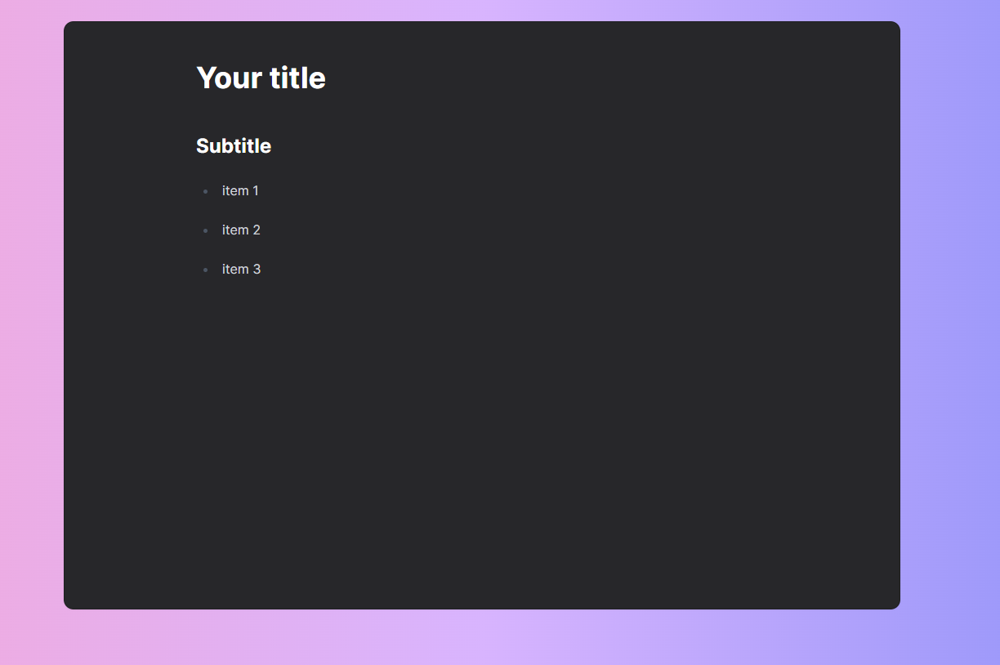

<h1 align="center"> NoteLab </h1>

   Web markdown editor
  

  <a href="#-technologies">Technologies</a>&nbsp;&nbsp;&nbsp;|&nbsp;&nbsp;&nbsp;
  <a href="#-project">Project</a>&nbsp;&nbsp;&nbsp;&nbsp;&nbsp;&nbsp;

 

  

## 🚀 Technologies

This project was developed with the following technologies:

- Tailwind CSS
- Vite
- TipTap
- LocalStorage

## 💻 Project

NoteLab is a simple web markdown editor

- [Final project](https://notelab-pi.vercel.app/)

---

Made by ♥ gustavosalviato :wave: [contact](https://www.linkedin.com/in/gustavo-salviato-910048212/)
